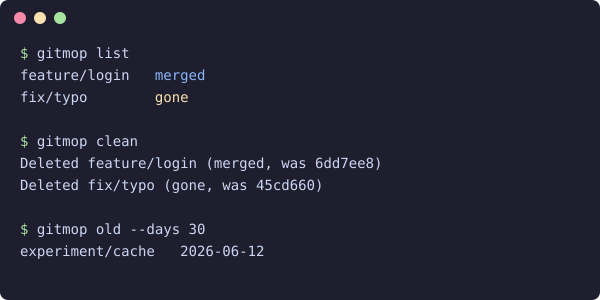

# gitmop

[](https://github.com/ulot2/gitmop/actions/workflows/ci.yml)
[](https://www.npmjs.com/package/gitmop)



Find and delete stale local git branches. Three commands, no dependencies.

## Why this exists

Every merged pull request leaves a local branch behind, and `git branch -d` refuses to delete the squash-merged ones.
After a few weeks, `git branch` is a wall of names, and you do not remember which ones are safe to delete.
gitmop lists the safe ones in one command and deletes them in a second one.

## Install

Run it without an install:

```bash
npx gitmop list
```

Or install it once:

```bash
npm install -g gitmop
```

You need Node.js 20 or newer and git.

## Usage

```
gitmop - find and delete stale local git branches

Usage: gitmop <command> [options]

Commands:
  list    Show stale branches: merged into the base branch, or remote branch gone
  clean   Delete the branches that "list" shows
  old     Show branches with no commit in the last N days

Options:
  --base <name>   Base branch (default: origin/HEAD, then main, then master)
  --days <n>      Age limit for "old", in days (default: 30)
  -h, --help      Show this help
  -v, --version   Show the version

"list" and "clean" run "git fetch --prune" first, so deleted remote branches
show as gone. "clean" never deletes the current branch or the base branch.
Each deleted branch prints its last commit hash, so "git branch <name> <hash>"
restores it.
```

## How it works

gitmop is one file that calls git and prints the result. A branch is stale when one of two things is true:

- **Merged**: `git branch --merged <base>` lists it, so all of its commits are in the base branch.
- **Gone**: the branch tracks a remote branch that no longer exists. This is what a squash-merged pull request leaves behind.

The steps for `list` and `clean` are:

1. Run `git fetch --prune`, so the local view of the remote is current.
2. Find the base branch from `origin/HEAD`. If it is unset, use `main` or `master`. `--base` overrides this.
3. Read every local branch with `git for-each-ref`, with its upstream state and last commit date.
4. Drop the current branch and the base branch from the list.
5. `list` prints the stale branches with the reason. `clean` deletes them: `git branch -d` for merged branches, `git branch -D` for gone branches.

`old` skips the fetch and prints branches whose last commit is older than `--days`, oldest first. It never deletes anything.

## Restore a deleted branch

`clean` prints the last commit hash of each branch it deletes. To bring one back:

```bash
git branch feature/login 6dd7ee8
```

## Develop

```bash
npm install
npm test
```

The test builds a real git repository in a temporary folder, with one branch of each kind, and runs the built tool against it.

## License

[MIT](LICENSE)
